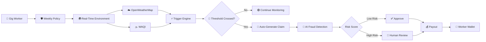
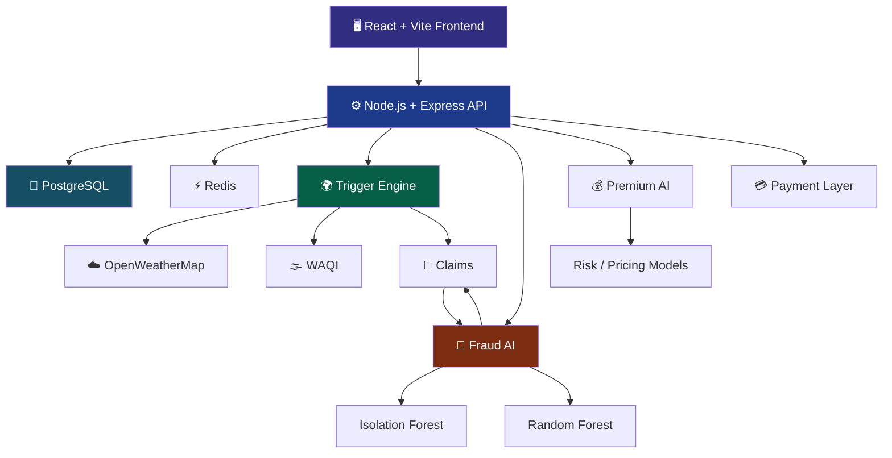

<div align="center">

# 🛡️ PRYSM

### **AI-Powered Parametric Income Protection for India's Gig Workforce**


<a href="https://github.com/AnshulAlgoS/Prysm">

</a>
<a href="https://github.com/AnshulAlgoS/Prysm">

</a>
<a href="https://github.com/AnshulAlgoS/Prysm">

</a>

<br/>


<br/><br/>

> **Protecting gig workers from income loss caused by extreme weather, hazardous AQI and city-level disruptions — using real-time environmental signals, automated parametric claims and AI-powered fraud detection.**

<br/>

[ 🚀 Features ](#-why-prysm) •
[ 🧠 AI Engine ](#-ai--fraud-detection) •
[ 🏗️ Architecture ](#️-architecture) •
[ 🎬 Demo ](#-live-demo) •
[ ⚡ Setup ](#-quick-start)

<br/>


</div>

---

# 🌩️ The Problem

India's gig economy depends on millions of delivery workers who earn based on **how much they can work each day**.

But when extreme weather or environmental disruption hits:

```text
        🌧️ Heavy Rain
              │
              ▼
        🚫 Cannot Deliver
              │
              ▼
        💸 Lost Daily Income
              │
              ▼
     ❌ Traditional Insurance
        = Slow + Manual + Complex
```

A delivery worker doesn't have the luxury of waiting **weeks** for an insurance claim.

They need protection in **minutes**.

### The real problem isn't only insurance.

It's **income volatility**.

A worker can lose an entire day's earnings because of:

- 🌧️ Extreme rainfall
- 🌫️ Hazardous air pollution
- 🌡️ Extreme heat
- 🚨 Local disruptions / curfews
- 🏙️ Location-specific environmental events

Traditional insurance models are designed around manual claims.

Gig workers need something fundamentally different.

---

# 🔮 Meet Prysm

<div align="center">

## **Insurance that reacts to the world around you.**

</div>

Prysm is a **zero-touch parametric insurance platform** designed specifically for India's gig delivery workforce.

Instead of asking:

> *"Can the worker prove exactly how much money they lost?"*

Prysm asks:

> **"Did the predefined disruption actually happen?"**

If the answer is yes, the system can automatically initiate the claim workflow.

No paperwork.

No long claim forms.

No waiting for manual inspection.

---

# ⚡ How Prysm Works



---

# 🧠 The Core Idea

Prysm combines **three systems**:

### 1. 🌍 Parametric Trigger Engine

The platform continuously evaluates environmental signals.

Example:

```text
Rainfall > predefined threshold
             +
Worker is covered in that zone
             ↓
        Trigger Event
             ↓
       Create Claim
```

The worker does not have to manually report the disruption.

---

### 2. 🧠 AI Sentinel

Every generated claim can pass through an AI-powered fraud detection layer.

Prysm uses machine-learning based anomaly detection to identify suspicious claim patterns.

```text
Claim
 │
 ├── Worker history
 ├── Claim frequency
 ├── Environmental conditions
 ├── Claim behaviour
 └── Risk signals
        │
        ▼
   AI Fraud Score
        │
   ┌────┴────┐
   ▼         ▼
Low Risk   High Risk
   │         │
   ▼         ▼
Approve    Review
```

The goal isn't to blindly reject claims.

The goal is:

> **Automate legitimate claims while keeping suspicious claims inside a human-in-the-loop review system.**

---

### 3. 💰 Income Protection

Once a valid disruption claim is verified, the worker enters the payout workflow.

The platform is designed around **weekly protection**, matching the earning cycle of gig workers.

### Example:

```text
Weekly Premium
₹30 ───────────── ₹120

        ↓

Coverage Activated

        ↓

Environmental Trigger

        ↓

Claim Created

        ↓

AI Risk Assessment

        ↓

Verification

        ↓

💰 Payout
```

---

# 🚀 Why Prysm?

<div align="center">

| Traditional Insurance | Prysm |
|---|---|
| Manual claim filing | ⚡ Automatic claim generation |
| Weeks of processing | 🚀 Real-time trigger workflow |
| Heavy documentation | 📄 Parametric verification |
| Generic insurance products | 👷 Built around gig workers |
| Limited environmental awareness | 🌍 Live environmental signals |
| Manual fraud screening | 🧠 AI-assisted fraud detection |
| Fixed salary assumptions | 💰 Weekly income protection |

</div>

---

# ✨ Key Features

## 👷 Worker Platform

### 🛡️ One-Click Protection

Workers can select coverage based on disruptions such as:

- 🌧️ Rain
- 🌫️ AQI
- 🌡️ Heat
- 🏙️ Location-based disruptions

The experience is designed to be simple enough for a worker to understand without needing insurance expertise.

---

### 💳 Digital Premium Collection

Prysm is designed around digital payment infrastructure for collecting weekly premiums.

Supported payment flow:

```text
Worker
  ↓
Select Coverage
  ↓
Choose Weekly Plan
  ↓
Payment
  ↓
Policy Activated
```

---

### 💰 Virtual Wallet

Workers can track:

- Premiums paid
- Claims
- Payouts
- Transaction history
- Coverage status

Everything is presented through a simple financial ledger.

---

# 🛡️ Admin Command Center

Prysm isn't just a worker application.

It also provides administrators with a complete operational view.

---

## 📊 System Analytics

Administrators can monitor:

- Active policies
- Active workers
- Claims
- Pending reviews
- Revenue
- Payouts
- Claim trends
- Disruption trends

This turns the insurance platform into a **real-time operational intelligence system**.

---

## 🚨 Fraud Command Center

AI-flagged claims appear inside the fraud monitoring dashboard.

Administrators can see:

```text
Claim ID
Worker
Disruption Type
Claim Amount
AI Risk Score
Review Status
```

Suspicious claims can be moved into human review instead of being automatically rejected.

---

## 🗺️ Risk Heatmap

The platform provides location-level visibility into disruption risk.

Administrators can identify areas experiencing:

- 🌧️ Rain risk
- 🌫️ AQI risk
- 🌊 Flood risk
- 🔥 Heat risk

This helps understand where environmental events may affect workers.

---

## ⚡ Trigger Engine Control

Administrators can manually trigger an environmental scan using:

```text
        FORCE ENV SCAN
              ↓
     Fetch Environment Data
              ↓
       Evaluate Thresholds
              ↓
      Detect Disruptions
              ↓
        Generate Claims
```

This is particularly useful during demonstrations and operational testing.

---

# 🧠 AI & Fraud Detection

Prysm uses dedicated AI microservices for risk analysis.

### AI Stack

```text
Python
   │
   ▼
FastAPI
   │
   ▼
Scikit-learn
   │
   ├── Random Forest
   │
   └── Isolation Forest
```

### Why Isolation Forest?

Fraud is often an **anomaly detection problem**.

Instead of requiring every possible fraudulent pattern to be explicitly defined, anomaly detection can identify behaviour that looks significantly different from normal claim activity.

This creates a second layer of protection:

```text
Parametric Trigger
       ↓
Claim Created
       ↓
AI Sentinel
       ↓
Risk Assessment
       ↓
┌───────────────┐
│               │
▼               ▼
Low Risk      Suspicious
│               │
▼               ▼
Approve      Human Review
```

---

# 🏗️ Architecture

Prysm follows a containerized microservice architecture.



---

# 🧩 Service Architecture

Prysm is composed of multiple Docker services:

| Service | Responsibility |
|---|---|
| `client` | React frontend |
| `server` | Node.js / Express API |
| `trigger-engine` | Environmental monitoring & claim triggers |
| `fraud-ai` | AI fraud detection |
| `premium-ai` | Premium / risk intelligence |
| `postgres` | Persistent database |
| `redis` | Caching & service coordination |

Everything runs together through **Docker Compose**.

---

# 🔄 End-to-End Claim Lifecycle

```text
┌──────────────────────┐
│      WORKER          │
│  Buys Weekly Policy  │
└──────────┬───────────┘
           │
           ▼
┌──────────────────────┐
│   POLICY ACTIVE      │
└──────────┬───────────┘
           │
           ▼
┌──────────────────────┐
│ ENVIRONMENT MONITOR  │
│ Weather + AQI APIs   │
└──────────┬───────────┘
           │
           ▼
      Threshold?
       /       \
     NO         YES
     │           │
     │           ▼
     │    ┌──────────────┐
     │    │ CLAIM CREATED│
     │    └──────┬───────┘
     │           │
     │           ▼
     │    ┌──────────────┐
     │    │  AI SENTINEL │
     │    └──────┬───────┘
     │           │
     │       Risk Score
     │        /       \
     │      LOW       HIGH
     │       │          │
     │       ▼          ▼
     │   APPROVE      REVIEW
     │       │          │
     │       └────┬─────┘
     │            │
     │            ▼
     │       PAYOUT FLOW
     │            │
     │            ▼
     │      👷 WORKER WALLET
     │
     └── Continue Monitoring
```

---

# 🛠️ Technology Stack

## Frontend

- **React 19**
- **Vite**
- **Chart.js**
- **Leaflet.js**
- **Framer Motion**

## Backend

- **Node.js 22**
- **Express**
- **PostgreSQL 16**
- **Redis 7**

## AI / ML

- **Python 3.12**
- **FastAPI**
- **Scikit-learn**
- **Random Forest**
- **Isolation Forest**

## Infrastructure

- **Docker**
- **Docker Compose**
- Multi-service container architecture

## External Services

- **OpenWeatherMap**
- **WAQI**
- Digital payment infrastructure

---

# ⚡ Quick Start

## Prerequisites

Make sure you have:

```text
Docker
Docker Compose
Git
```

installed on your machine.

---

## 1️⃣ Clone the Repository

```bash
git clone https://github.com/AnshulAlgoS/Prysm.git
```

---

## 2️⃣ Enter the Project

```bash
cd Prysm
```

---

## 3️⃣ Configure Environment Variables

Create your environment file:

```bash
cp .env.example .env
```

Configure the required API credentials:

```env
OPENWEATHER_API_KEY=your_openweather_key
WAQI_API_KEY=your_waqi_key
```

Payment credentials can be added when payment functionality is required.

---

## 4️⃣ Start the Entire Platform

```bash
docker compose up --build -d
```

Docker will start the complete Prysm infrastructure.

```text
React Frontend
       +
Node API
       +
Trigger Engine
       +
Fraud AI
       +
Premium AI
       +
PostgreSQL
       +
Redis
```

---

# 🌐 Access the Platform

Once the containers are healthy:

### Frontend

```text
http://localhost
```

### Backend

```text
http://localhost:5001
```

### Fraud AI

```text
http://localhost:8002
```

### Premium AI

```text
http://localhost:8001
```

---

# 🔐 Demo Credentials

### 👨‍💼 Admin

```text
Phone: 9999999999
Password: admin123
```

### 👷 Worker

```text
Phone: 8856543210
Password: worker123
```

> These credentials are intended for local/demo environments only.

---

# 🎬 Live Demo

The fastest way to demonstrate Prysm's core functionality:

### Step 1

Login as:

```text
Admin
```

### Step 2

Open:

```text
Claims Monitor
```

### Step 3

Click:

```text
⚡ FORCE ENV SCAN
```

### Step 4

Prysm fetches the latest environmental information.

### Step 5

The trigger engine evaluates predefined disruption thresholds.

### Step 6

If a covered disruption is detected:

```text
Environmental Event
        ↓
Threshold Triggered
        ↓
Claim Created
        ↓
AI Fraud Analysis
        ↓
Risk Assessment
        ↓
Human Review / Approval
        ↓
Payout Workflow
```

---

# 🎥 Recommended Demo Flow

For the best 2-minute presentation:

```text
00:00  →  The Problem
00:15  →  Prysm Introduction
00:30  →  Worker Policy Purchase
00:45  →  Environmental Trigger
01:00  →  Automatic Claim
01:15  →  AI Fraud Detection
01:30  →  Admin Analytics
01:40  →  Risk Heatmap
01:50  →  Worker Wallet / Payout
02:00  →  Closing
```

### The key message:

> **"The worker doesn't chase the claim. The system detects the disruption and starts the process for them."**

---

# 📁 Project Structure

```text
Prysm/
│
├── client/
│   ├── src/
│   ├── public/
│   └── Dockerfile
│
├── server/
│   ├── src/
│   ├── routes/
│   ├── services/
│   └── Dockerfile
│
├── trigger-engine/
│   ├── src/
│   └── Dockerfile
│
├── fraud-service/
│   ├── model/
│   ├── api/
│   └── Dockerfile
│
├── premium-service/
│   ├── model/
│   ├── api/
│   └── Dockerfile
│
├── docs/
│   └── SETUP.md
│
├── docker-compose.yml
├── .env.example
├── LICENSE.md
└── README.md
```

---

# 🔐 Security Philosophy

Prysm is designed around multiple layers of verification.

```text
Environmental Verification
          +
Policy Verification
          +
Worker Verification
          +
AI Risk Analysis
          +
Human Review
          ↓
      Payout
```

The objective is to prevent a single signal from being enough to trigger an unsafe payout.

---

# 🎯 What Makes Prysm Different?

### Traditional insurance asks:

> **"Prove your loss."**

### Prysm asks:

> **"Did the disruption happen?"**

That distinction is the foundation of parametric insurance.

Instead of building another generic insurance dashboard, Prysm is designed around the **actual income cycle of gig workers**.

---

# 🌍 Designed for India's Gig Economy

Prysm targets the unique characteristics of India's delivery workforce:

```text
Flexible Work
     +
Variable Income
     +
Digital Payments
     +
Location-Based Work
     +
Environmental Exposure
     ↓
Parametric Income Protection
```

A worker shouldn't have to become an insurance expert to protect their income.

---

# 🚀 Future Roadmap

### Phase 1 — Foundation

- [x] Worker dashboard
- [x] Admin dashboard
- [x] Policy management
- [x] Claims workflow
- [x] Environmental trigger engine
- [x] AI fraud service
- [x] Dockerized architecture

### Phase 2 — Intelligence

- [ ] More sophisticated fraud signals
- [ ] Better claim anomaly detection
- [ ] Dynamic risk scoring
- [ ] Personalized premium pricing
- [ ] Improved geographic risk modelling

### Phase 3 — Scale

- [ ] Multi-city deployment
- [ ] More environmental data sources
- [ ] Partner integrations
- [ ] Production payment infrastructure
- [ ] Mobile-first worker experience

---

# 📈 Vision

Prysm isn't trying to make insurance more complicated.

It's trying to make it **invisible**.

The best insurance experience for a gig worker should be:

```text
BUY
 ↓
WORK
 ↓
DISRUPTION
 ↓
DETECTION
 ↓
CLAIM
 ↓
PAYOUT
```

with as little manual intervention as possible.

---

# 💡 The Vision Behind Prysm

> ### **When the environment interrupts someone's ability to earn, their financial protection should react automatically.**

Prysm turns environmental data into financial protection.

It connects:

**🌍 Real-world disruption**

↓

**⚡ Parametric triggers**

↓

**🧠 AI risk intelligence**

↓

**📄 Automated claims**

↓

**💰 Income protection**

---

<div align="center">

# 🛡️ PRYSM

### **Protect income. Predict disruption. Pay faster.**

<br/>

**Built with purpose by Team AtenRise**

<br/>


<br/>

<a href="https://github.com/AnshulAlgoS/Prysm">

</a>

<br/><br/>


</div>